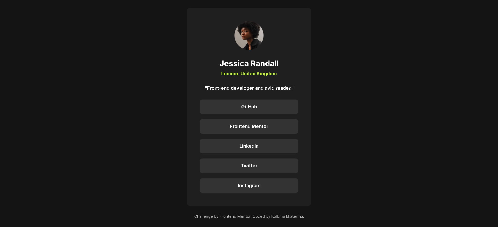
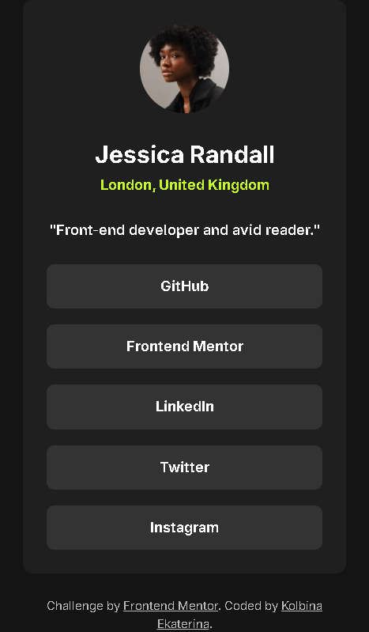

# Social Links Profile

---

## English

### 📖 Description

A responsive social links profile page where users can find all social media accounts in one place.  
The project is fully adapted for mobile devices and desktops.

---

### 🛠 Technologies

- HTML5
- CSS3 (Flexbox, media queries)
- Google Fonts (Inter)

---

### 📸 Features

- Semantic HTML with proper landmarks (`<main>`, `<article>`, `<header>`, `<section>`)
- Accessibility for screen readers (visually hidden headings, `:focus-visible`)
- Fully responsive design (375px → 1440px)
- Smooth hover and focus transitions
- Interactive states for all clickable elements
- Clean and maintainable CSS with custom properties
- Mobile-first approach
- `prefers-reduced-motion` support

---

### 🖼️ Screenshots

| Desktop version | Mobile version |
|-----------------|----------------|
|  |  |

---

### 🚀 Demo

Check out the live version here:  
[GitHub Pages Link](https://ekaterina-alekse.github.io/social-links-profile-main/)

---

### 📚 What I learned

Working on this project helped me better understand several key concepts:

- Using **semantic HTML** (`<main>`, `<article>`, `<header>`, `<section>`) to improve structure and accessibility.
- Implementing **accessibility best practices**, such as visually hidden headings, `:focus-visible` for keyboard navigation, and `prefers-reduced-motion`.
- Applying **media queries** with a **mobile-first approach** for better performance on smaller devices.
- Using **CSS custom properties** (variables) for maintainable and consistent styling.
- Creating **smooth interactive states** with `:hover`, `:focus`, and `:active` pseudo-classes.
- Using **logical properties** (`margin-block-end`, `padding-inline`) for better internationalization.
- Validating code with **W3C validator** to ensure 0 errors and 0 warnings.

---

### 🔮 What I would improve next time

- Add dark/light theme toggle.
- Use `clamp()` for more fluid typography.
- Add more personal information and real social media links.

---

### 👩‍💻 Author

**Ekaterina Kolbina**

- GitHub: [Ekaterina-alekse](https://github.com/Ekaterina-alekse)
- Frontend Mentor: [@Ekaterina-alekse](https://www.frontendmentor.io/profile/Ekaterina-alekse)

---

### 📄 License

This project is for educational purposes only and is not intended for commercial use.

---

---

## Русский

### 📖 Описание

Адаптивная страница с профилем социальных ссылок, где пользователи могут найти все социальные сети в одном месте.  
Сайт полностью адаптирован для мобильных устройств и десктопов.

---

### 🛠 Технологии

- HTML5
- CSS3 (Flexbox, медиа-запросы)
- Google Fonts (Inter)

---

### 📸 Особенности

- Семантическая вёрстка с правильными ориентирами (`<main>`, `<article>`, `<header>`, `<section>`)
- Доступность для скринридеров (скрытые заголовки, `:focus-visible`)
- Полностью адаптивный дизайн (375px → 1440px)
- Плавные анимации при наведении и фокусе
- Интерактивные состояния для всех кликабельных элементов
- Чистый и поддерживаемый CSS с кастомными свойствами
- Mobile-first подход
- Поддержка `prefers-reduced-motion`

---

### 🖼️ Скриншоты

| Десктопная версия | Мобильная версия |
|-------------------|------------------|
|  |  |

---

### 🚀 Демо

Посмотреть готовый проект можно по ссылке:  
[Ссылка на GitHub Pages](https://ekaterina-alekse.github.io/social-links-profile-main/)

---

### 📚 Что я узнала за время работы над проектом

- Как использовать **семантический HTML** (`<main>`, `<article>`, `<header>`, `<section>`) для улучшения структуры и доступности.
- Как реализовать **доступность** (accessibility) с помощью скрытых заголовков, `:focus-visible` для навигации с клавиатуры и `prefers-reduced-motion`.
- Как делать адаптивную вёрстку с **mobile-first подходом** для лучшей производительности на мобильных устройствах.
- Как использовать **CSS-переменные** для поддерживаемой и консистентной стилизации.
- Как создавать **плавные интерактивные состояния** с помощью псевдоклассов `:hover`, `:focus` и `:active`.
- Как использовать **логические свойства** (`margin-block-end`, `padding-inline`) для лучшей интернационализации.
- Как проверять код в **W3C-валидаторе**, чтобы убедиться в отсутствии ошибок и предупреждений.

---

### 🔮 Что я хочу улучшить в следующих проектах

- Добавить переключение тёмной/светлой темы.
- Использовать `clamp()` для более гибкой типографики.
- Добавить больше личной информации и реальные ссылки на соцсети.

---

### 👩‍💻 Автор

**Екатерина Колбина**

- GitHub: [Ekaterina-alekse](https://github.com/Ekaterina-alekse)
- Frontend Mentor: [@Ekaterina-alekse](https://www.frontendmentor.io/profile/Ekaterina-alekse)

---

### 📄 Лицензия

Этот проект является учебным и не предназначен для коммерческого использования.